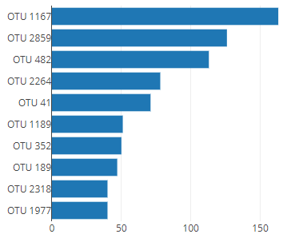
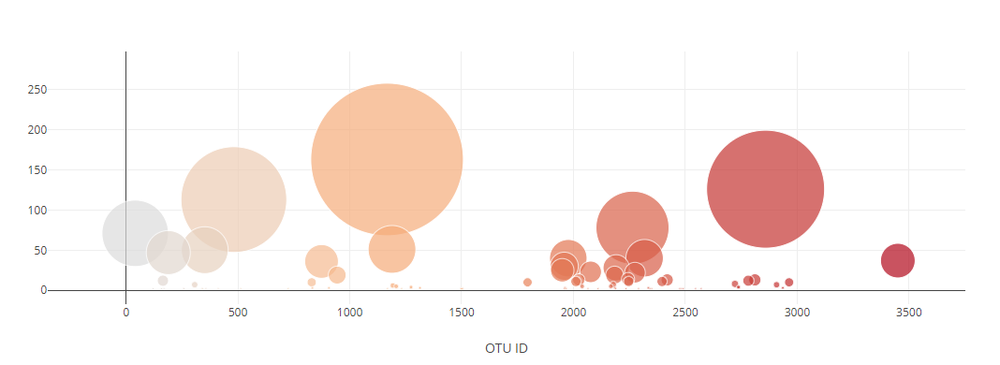
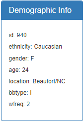

# belly-button-challenge
Building an interactive dashboard to explore a belly button biodiversity dataset

Contributor: Brian Kath

Repository Structure - 

	- Main folder
		- README.md
		- index.html
		- samples.json
	
	- Sub-folders
		- images
			- bar_chart.png
			- bubble_chart.png
			- demo_info.png
		- static
			-js
				- .gitkeep
				- app.js

Overview - 

For this project, I used the D3 JavaScript library and Plotly to develop an interactive dashboard to explore a belly button biodiversity dataset. I first retrieved the dataset using the d3.json function from this <a href="https://2u-data-curriculum-team.s3.amazonaws.com/dataviz-classroom/v1.1/14-Interactive-Web-Visualizations/02-Homework/samples.json">URL</a>. The same data is also available for reference in the samples.json file located in the main forlder of the repository. Then, using Plotly, I created a horizontal bar chart to display the top 10 OTUs(operational taxonomic units) found in the individual 

The live dashboard is available here:
<a href="https://brnkath.github.io/belly-button-challenge/">brnkath.github.io/belly-button-challenge/</a>
